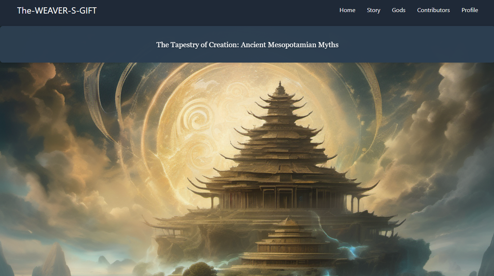
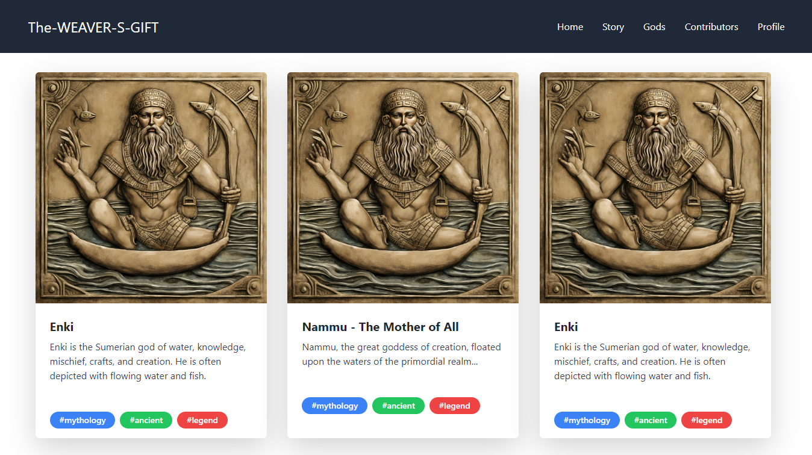
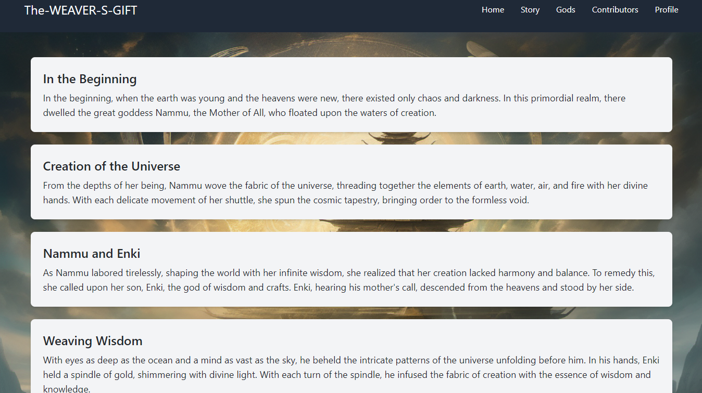

# The-Weaver-s-Gift

Culture: Ancient Mesopotamia

Genre: Myth

Theme: Creation and Wisdom

## Table of Contents
1. [Description](#description)
2. [Purpose of This Project](#purpose-of-this-project)
3. [Getting Started](#getting-started)
    - [Prerequisites](#prerequisites)
    - [How to Run the Project](#how-to-run-the-project)
4. [Contributing](#contributing)
5. [Guidelines](#guidelines)
6. [License](#license)
7. [Contributors](#contributors) 

## Description


In the beginning, when the earth was young and the heavens were new, there existed only chaos and darkness. In this primordial realm, there dwelled the great goddess Nammu, the Mother of All, who floated upon the waters of creation.

From the depths of her being, Nammu wove the fabric of the universe, threading together the elements of earth, water, air, and fire with her divine hands. With each delicate movement of her shuttle, she spun the cosmic tapestry, bringing order to the formless void.

As Nammu labored tirelessly, shaping the world with her infinite wisdom, she realized that her creation lacked harmony and balance. To remedy this, she called upon her son, Enki, the god of wisdom and crafts.

Enki, hearing his mother's call, descended from the heavens and stood by her side. With eyes as deep as the ocean and a mind as vast as the sky, he beheld the intricate patterns of the universe unfolding before him.

In his hands, Enki held a spindle of gold, shimmering with divine light. With each turn of the spindle, he infused the fabric of creation with the essence of wisdom and knowledge, weaving a tapestry of enlightenment that would guide the destinies of mortals.

Together, Nammu and Enki worked in harmony, their combined efforts bringing forth the wonders of the world. Mountains rose from the earth, rivers flowed across the land, and forests teemed with life. Stars twinkled in the night sky, and the sun and moon danced in their eternal cycles.

And so, through the sacred art of weaving, the goddess Nammu and her son Enki brought order and beauty to the cosmos, setting in motion the great tapestry of existence that would bind all living things together in a web of interconnectedness and harmony.

To this day, the legacy of their creation endures, reminding mortals of the divine wisdom that resides within the fabric of the universe, waiting to be unraveled by those who seek enlightenment and understanding.



## Purpose of This Project

The purpose of The-Weaver-s-Gift project is to create an ancient and magical-looking website using open-source contributions. This project aims not only to develop a visually stunning web platform but also to share knowledge about how to engage in open-source projects. Additionally, it's an opportunity for contributors to have fun while exploring and creating within the realms of ancient mythology and craftsmanship.



## Getting Started
### Prerequisites
Before running this project, ensure you have the following installed on your machine:

- Node.js (v14 or higher)
- npm or Yarn (for dependency management)

### How to Run the Project

To run this project locally, follow these steps:

1. Clone the repository to your local machine using Git:

    ```bash
    git clone https://github.com/your-username/The-Weaver-s-Gift.git
    ```

2. Navigate into the project directory:

    ```bash
    cd The-Weaver-s-Gift
    ```

3. Install dependencies using your preferred package manager (e.g., npm or yarn):

    ```bash
    npm install
    ```

    or

    ```bash
    yarn install
    ```

4. Once the dependencies are installed, start the development server:

    ```bash
    npm run dev
    ```

    or

    ```bash
    yarn dev
    ```

5. Open your web browser and navigate to `http://localhost:3000` to view the website.

## Contributing

We welcome contributions! To contribute to The Weaver's Gift, please follow these steps:

1. Check out the issues labeled with hacktoberfest to find tasks suitable for contribution.
2. Fork the repository to your own GitHub account.
3. Create a new branch for your feature or fix:
```bash
git checkout -b my-feature-branch
```
4. Make your changes and commit them:
```bash
git commit -m "Add my feature"
```
5. Push your changes to your fork:
```bash
git push origin my-feature-branch
```
6. Create a Pull Request on the original repository, and ensure you link to the issue you are addressing if applicable.

## Guidelines
- Follow the project's coding style and conventions.
- Write clear commit messages.
- Ensure your code is well-documented.

## License
This project is licensed under the MIT License. See the LICENSE file for more details.

## Contributors
Thanks to all the amazing contributors who have helped bring The Weaver's Gift to life! 🎉

<table>
  <tr>
    <td align="center">
      <a href="https://github.com/D-Binara">
        
        <br /><sub><b>D-Binara</b></sub>
      </a>
    </td>
    <td align="center">
      <a href="https://github.com/Matheus-Parreira">
        
        <br /><sub><b>Matheus-Parreira</b></sub>
      </a>
    </td>
    <td align="center">
      <a href="https://github.com/ChaudaryHammad">
        
        <br /><sub><b>ChaudaryHammad</b></sub>
      </a>
    </td>
     <td align="center">
      <a href="https://github.com/trungnguyenM01">
        
        <br /><sub><b>trungnguyenM01</b></sub>
      </a>
    </td>
    <td align="center">
      <a href="https://github.com/nsrabt">
        
        <br /><sub><b>nsrabt</b></sub>
      </a>
    </td>
  </tr>
</table>

